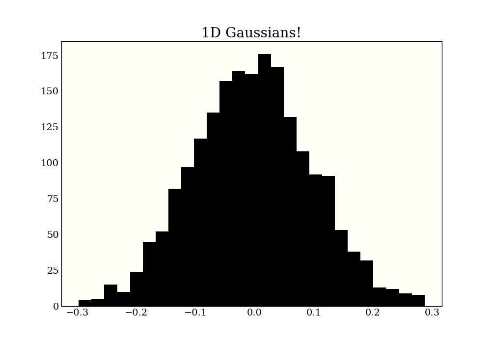
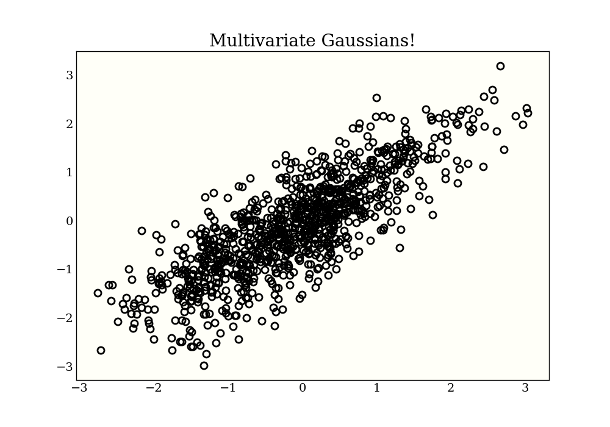
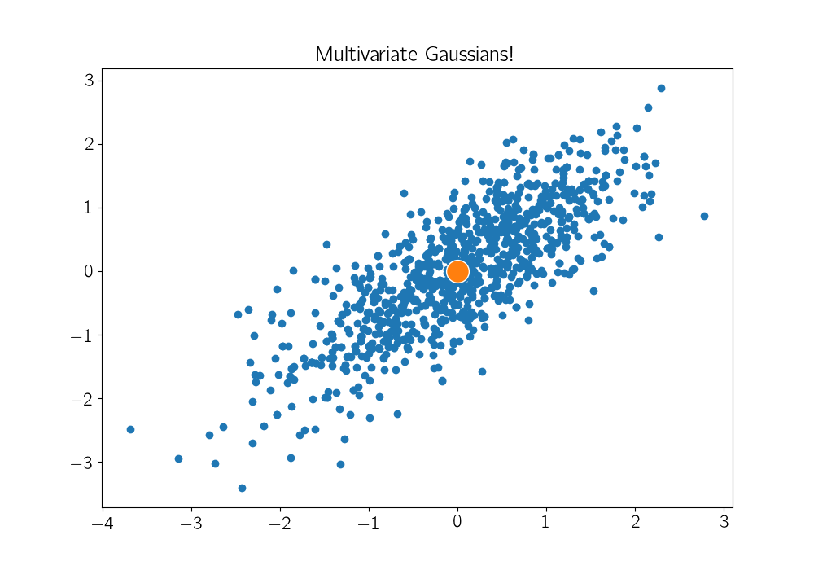
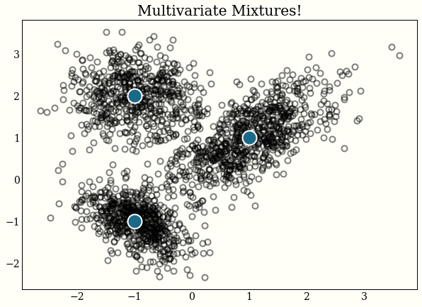
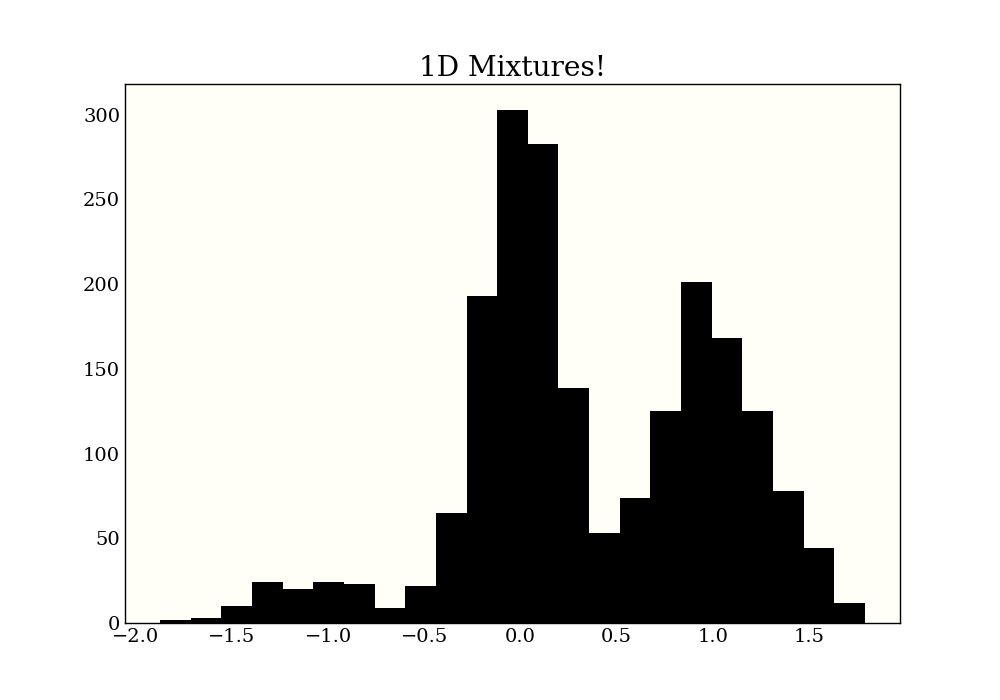
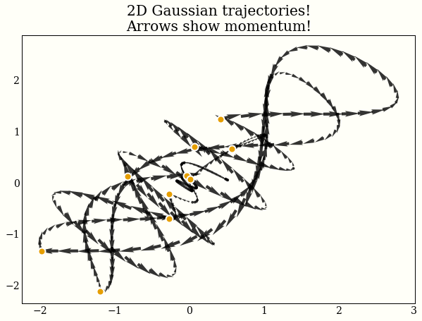
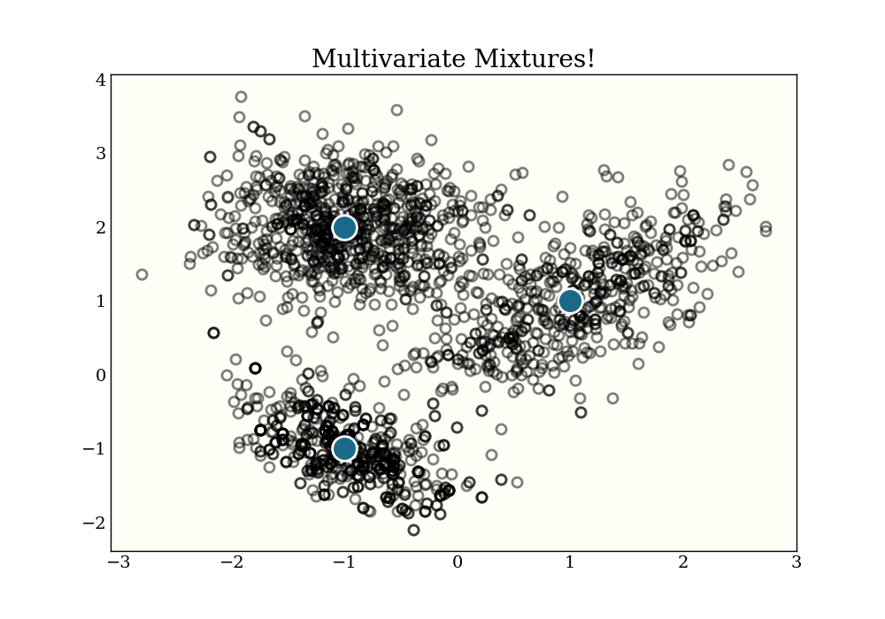
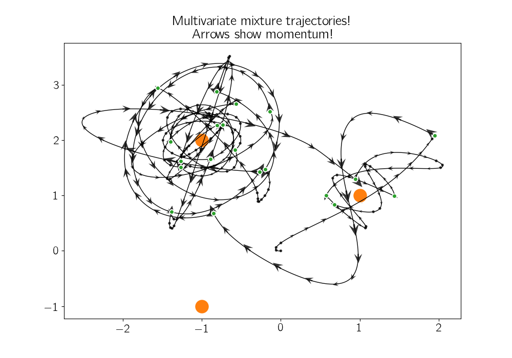

minimc
======

*Just a little MCMC*
--------------------
[](https://travis-ci.org/ColCarroll/minimc) [](https://coveralls.io/github/ColCarroll/minimc?branch=master)

This is a test library to provide reference implementations of MCMC algorithms and ideas. The basis and reference for much of this library is from Michael Betancourt's wonderful [A Conceptual Introduction to Hamiltonian Monte Carlo](https://arxiv.org/abs/1701.02434).

**The highlight of the library** right now is the ~15 line [Hamiltonian Monte Carlo implementation](minimc/minimc.py) (which relies on an 8 line integrator). Both of these are commented and documented, but aim to be instructive to read.

Currently Implemented
---------------------

- Step size tuning
- Leapfrog integrator
- Hamiltonian Monte Carlo
- Some log probabilities (normal, multivariate normal, mixtures, funnel)

Roadmap
-------

- Divergences
- Mass matrix adaptation
- Diagnostics
- [NUTS](https://arxiv.org/abs/1111.4246)
- [Empirical HMC](https://arxiv.org/abs/1810.04449)
- Riemannian Manifold HMC [Girolami & Calderhead](http://citeseerx.ist.psu.edu/viewdoc/download?doi=10.1.1.221.6963&rep=rep1&type=pdf) and [Betancourt](https://arxiv.org/abs/1212.4693)

Installation
------------

I would suggest cloning this and playing with the source code, but it can be pip installed with
```bash
pip install git+git://github.com/colcarroll/minimc.git
```

Examples
--------

The API of `minimc` is mimicked in `minimc.minimc_slow`, which returns trajectories instead of just samples. This makes for nicer images and experiments, but it is a bit slower.

```python
import autograd.numpy as np
from minimc import neg_log_normal, hamiltonian_monte_carlo

samples = hamiltonian_monte_carlo(2_000, neg_log_normal(0, 0.1),
                                  initial_position=0.)

100%|███████████████████████████████████████████| 2500/2500 [00:04<00:00, 615.91it/s]
```



```python
from minimc.minimc_slow import hamiltonian_monte_carlo as hmc_slow

samples, positions, momentums, accepted  = hmc_slow(50, neg_log_normal(0, 0.1),
                                                         initial_position=0.,
                                                         step_size=0.01)

100%|███████████████████████████████████████████| 50/50 [00:00<00:00, 52.72it/s]
```


```python
from minimc import neg_log_mvnormal

mu = np.zeros(2)
cov = np.array([[1.0, 0.8], [0.8, 1.0]])
neg_log_p = neg_log_mvnormal(mu, cov)

samples = hamiltonian_monte_carlo(1000, neg_log_p, np.zeros(2))

100%|███████████████████████████████████████████| 1500/1500 [00:02<00:00, 623.13.92it/s]
```



```python
samples, positions, momentums, accepted = hmc_slow(10, neg_log_p, np.zeros(2),
                                                   path_len=4,
                                                   step_size=0.01)

100%|███████████████████████████████████████████| 10/10 [00:01<00:00, 9.06it/s]
```



```python
from minimc import mixture

neg_log_probs = [neg_log_normal(1.0, 0.5), neg_log_normal(-1.0, 0.5)]
probs = np.array([0.2, 0.8])
neg_log_p = mixture(neg_log_probs, probs)
samples = hamiltonian_monte_carlo(2000, neg_log_p, 0.0)

neg_log_probs = [
    neg_log_normal(-1.0, 0.3),
    neg_log_normal(0., 0.2),
    neg_log_normal(1.0, 0.3),
    ]
probs = np.array([0.1, 0.5, 0.4])
neg_log_p = mixture(neg_log_probs, probs)
samples = hamiltonian_monte_carlo(2_000, neg_log_p, 0.)

100%|███████████████████████████████████████████| 2000/2000 [00:09<00:00, 261.17it/s]
```



```python
samples, positions, momentums, accepted = hmc_slow(100, neg_log_p, 0.0, step_size=0.01)

100%|███████████████████████████████████████████| 100/100 [00:07<00:00, 14.04it/s]
```



```python
mu1 = np.ones(2)
cov1 = 0.5 * np.array([[1.0, 0.7],
                       [0.7, 1.0]])
mu2 = -np.ones(2)
cov2 = 0.2 * np.array([[1.0, -0.6],
                       [-0.6, 1.0]])

mu3 = np.array([-1.0, 2.0])
cov3 = 0.3 * np.eye(2)

neg_log_p = mixture(
    [
        neg_log_mvnormal(mu1, cov1),
        neg_log_mvnormal(mu2, cov2),
        neg_log_mvnormal(mu3, cov3),
    ],
    [0.3, 0.3, 0.4],
)

samples = hamiltonian_monte_carlo(2000, neg_log_p, np.zeros(2))

100%|███████████████████████████████████████████| 2500/2500 [00:11<00:00, 212.83it/s]
```



```python
samples, positions, momentums, accepted = hmc_slow(20, neg_log_p, np.zeros(2),
                                                   path_len=3,
                                                   step_size=0.01)

100%|███████████████████████████████████████████| 20/20 [00:08<00:00, 2.31it/s]
```


